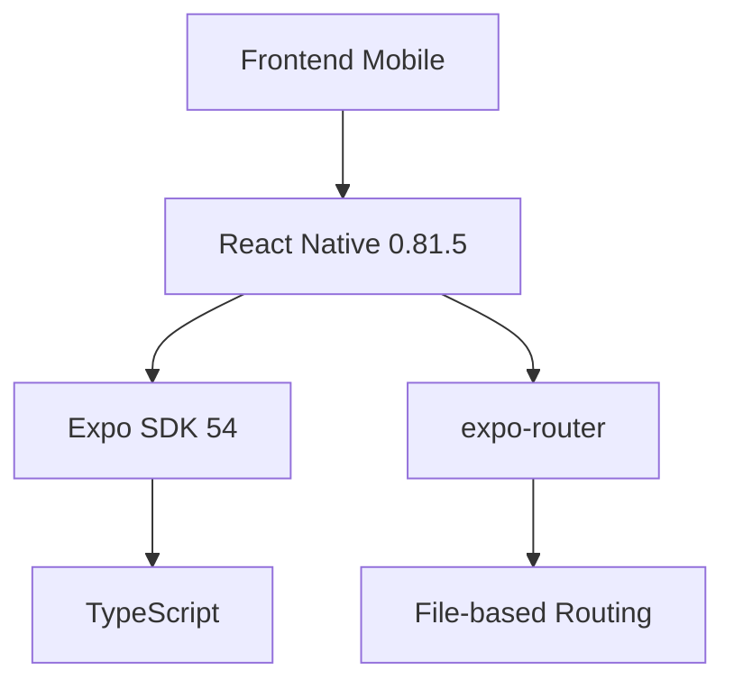

# Sistema de Gerenciamento de Posts Administrativos

## Descrição do Projeto

Este projeto acadêmico implementa um sistema mobile multiplataforma para gerenciamento de postagens administrativas, demonstrando a aplicação prática de conceitos avançados de desenvolvimento mobile usando React Native e Expo.

### Objetivo Acadêmico

O projeto visa demonstrar proficiência em:
- Arquitetura de aplicações móveis modernas
- Implementação de sistemas de autenticação
- Gerenciamento de estado global
- Roteamento dinâmico em aplicações React Native
- Desenvolvimento multiplataforma (Android/iOS/Web)

## Arquitetura e Tecnologias

### Stack Tecnológico Principal



#### Framework e Runtime
- **Expo SDK ~54.0.20**: Framework para desenvolvimento React Native
- **React Native 0.81.5**: Core do desenvolvimento mobile
- **TypeScript 5.9.2**: Tipagem estática e features modernas de ES

#### Gerenciamento de Estado e Autenticação
- **Context API**: Implementado via `AuthContext` para gerenciamento global de autenticação
- **expo-router ~6.0.13**: Sistema de roteamento baseado em arquivos
- **@react-navigation**: Stack e Tab navigation integrados

#### UI/UX Components
- **@expo/vector-icons**: Biblioteca de ícones vetoriais
- **react-native-reanimated**: Animações performáticas
- **react-native-gesture-handler**: Gestos nativos
- **react-native-safe-area-context**: Adaptação a diferentes tamanhos de tela

## Estrutura do Projeto

```
src/
├── app/                    # Rotas e telas da aplicação
│   ├── _layout.tsx        # Layout principal e navegação
│   ├── (tabs)/            # Grupo de rotas com tabs
│   │   ├── _layout.tsx    # Configuração das tabs
│   │   ├── index.tsx      # Tela inicial
│   │   └── ...           # Outras telas
├── components/            # Componentes reutilizáveis
│   ├── themed/           # Componentes com suporte a tema
│   └── ui/               # Componentes de interface
├── hooks/                # Hooks customizados
├── context/              # Contextos globais
└── constants/            # Constantes e temas
```

## Funcionalidades Implementadas

### 1. Sistema de Navegação
- Navegação em tabs com bottom bar customizada
- Roteamento dinâmico baseado em arquivos
- Deep linking suportado nativamente

### 2. Autenticação
- Fluxo completo de autenticação via Context
- Proteção de rotas administrativas
- Persistência de sessão

### 3. Gestão de Posts
- CRUD completo de postagens, professores e estudantes
- Interface administrativa dedicada

### 4. Interface Responsiva
- Suporte a temas claro/escuro
- Adaptação automática a diferentes dispositivos
- Componentes estilizados reutilizáveis

## Patterns e Boas Práticas

### Padrões de Projeto Utilizados
1. **Provider Pattern**
   - Implementado via Context API
   - Gerenciamento global de estado

2. **Component Composition**
   - Componentes modulares e reutilizáveis
   - Themed components para consistência visual

3. **Custom Hooks**
   - Abstração de lógica comum
   - Hooks específicos para tema e autenticação

### Clean Code
- Nomenclatura clara e consistente
- Separação de responsabilidades
- Componentização efetiva

## Setup do Ambiente de Desenvolvimento

```powershell
# Instalação de dependências
npm install

# Iniciar em modo desenvolvimento
npm start

# Executar em plataformas específicas
npm run android  # Android
npm run ios      # iOS
npm run web      # Versão Web
```

### Requisitos do Sistema
- Node.js 18+
- npm 9+
- Expo CLI
- Android Studio (para emulador Android)
- Xcode (para emulador iOS - apenas macOS)

## Testes e Qualidade

### Ferramentas de Qualidade
- **ESLint**: Configurado com regras estritas
- **TypeScript**: Checagem estática de tipos
- **Expo Doctor**: Verificação de configuração

## Conclusão e Aprendizados

Este projeto demonstra a implementação prática de conceitos modernos de desenvolvimento mobile, incluindo:
- Arquitetura escalável e manutenível
- Padrões de projeto React/React Native
- TypeScript em ambiente mobile
- Gestão de estado e autenticação
- Roteamento avançado com expo-router